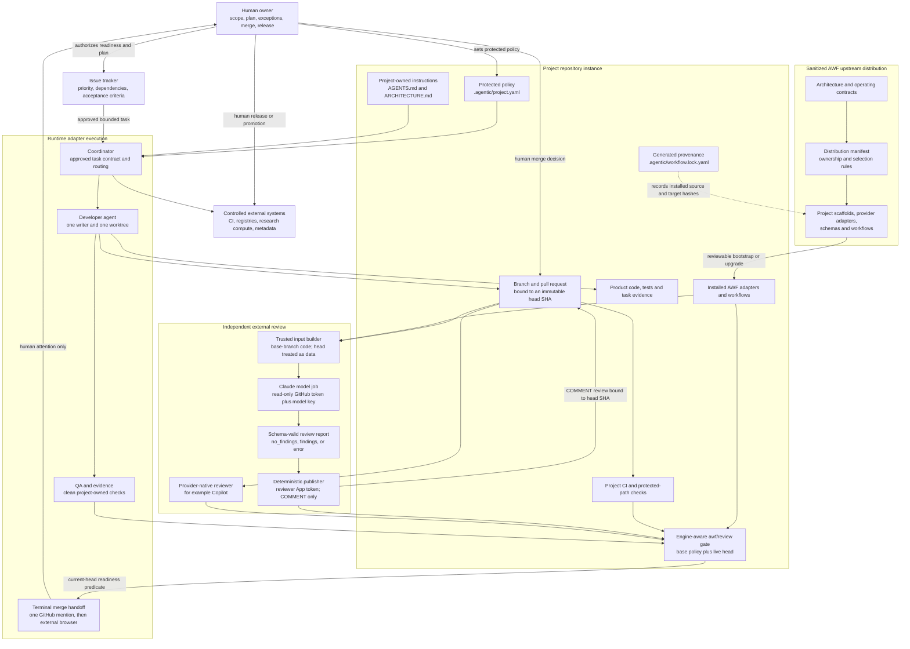
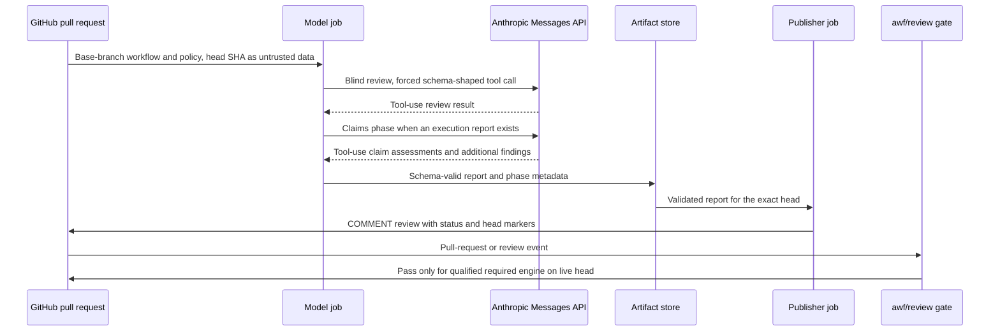

# Agentic Workflow Framework: Integrated System Architecture

## Purpose and authority

This document is the single integrated description of the Agentic Workflow
Framework (AWF): what is distributed, what is installed in a project, how an
agent-authored change moves from an approved task to a reviewed pull request,
where authority and durable state live, and how the independent-review gate
fails closed.

The root [ARCHITECTURE.md](../ARCHITECTURE.md) remains authoritative for
architectural decisions and invariants. This document explains the implemented
system as a whole and links to the narrower normative contracts. If this
overview conflicts with a protected project policy or a normative document,
the protected policy and the narrower contract govern.

AWF is a framework and control-plane distribution, not a continuously running
application or a replacement for an issue tracker, source-control platform,
CI system, research platform, registry, or secret store. The AWF repository can
serve both as the sanitized upstream template and as a project-local instance
that dogfoods the distributed workflow.

## System architecture

The solid arrows show authority or data flow. The dotted provenance edge is a
record of what was installed; the lock does not grant authority and is not a
mutable runtime database.

## Deployment model

AWF has two related forms:

1. **Upstream distribution.** This repository contains generic architecture,
   policy, scaffolds, schemas, provider adapters, tests, and documentation. It
   contains no downstream product code, credentials, datasets, raw tool logs,
   or confidential project material.
2. **Project-local instance.** A bootstrap pull request installs selected
   artifacts into a product repository. The product repository retains its own
   history, instructions, architecture, code, tests, CI, branch rules, secrets,
   reviewer configuration, and release controls.

The canonical artifact list and ownership policy are in the
[distribution manifest](../.agentic-workflow/distribution-manifest.yaml):

| Ownership class | Bootstrap and upgrade behavior |
|---|---|
| `managed` | AWF supplies reviewed updates; local drift blocks replacement. |
| `seed_once` | AWF creates the initial file; the project owns later changes. |
| `merge_assisted` | AWF proposes a delimited or reviewable amendment and never overwrites the project. |
| `local_only` | The project creates and owns the file; AWF never collects it. |
| `generated` | Tooling derives the file from final installed content and records hashes. |

Bootstrap and upgrade are currently manual, reviewable procedures. A GitHub
template can seed a greenfield repository, but it does not synchronize later
changes. See [BOOTSTRAPPING.md](BOOTSTRAPPING.md) and
[UPGRADING.md](UPGRADING.md).

## Components and responsibilities

| Component | Responsibility | Durable authority or evidence |
|---|---|---|
| Human owner | Approves readiness, execution plans, exceptions, merge, release, and promotion | Human identity, protected policy, PR and audit history |
| Issue tracker | Owns business priority, dependencies, ownership, and acceptance criteria | Issue state and history |
| AWF upstream | Publishes sanitized contracts, policies, adapters, tests, and scaffolds | Git history and distribution manifest |
| Product repository | Owns product code, project architecture, instructions, tests, CI, and releases | Project Git history and server-side settings |
| `.agentic/project.yaml` | Defines the project ceiling, protected paths, identities, review selection, and qualification state | Protected project file |
| `.agentic/workflow.lock.yaml` | Records bootstrap base, selected adapters, ownership classes, Git blob IDs, and content hashes | Generated, reviewable project file |
| Runtime adapter | Maps AWF tasks to a native agent runtime; Codex is the first adapter | Runtime task plus structured handoff |
| Developer agent | Implements one approved bounded task in one worktree and branch | Commit, diff, execution report, and test evidence |
| QA/evidence process | Runs project-owned gates without repairing failures | CI result and immutable evidence references |
| External review engine | Independently reviews the current head from fresh context | Structured review result and provider identity |
| Review publisher | Validates and posts model output without exposing its write credential to the model | COMMENT review bound to the head SHA |
| `awf/review` gate | Verifies required-engine identity, qualification, status marker, dismissal state, and live head | GitHub Actions check |

The systems-of-record allocation is normative in
[ARCHITECTURE.md](../ARCHITECTURE.md). Agent chat or task history is never the
sole durable state.

## Project control plane

The effective project control plane is distributed across independently
protected mechanisms:

- `AGENTS.md` and applicable nested instruction files define agent behavior;
- `ARCHITECTURE.md` defines project boundaries and decisions;
- `.agentic/project.yaml` defines the maximum autonomy level, protected paths,
  identities, reviewer selection, and qualification flags;
- `.agentic/workflow.lock.yaml` attests installed framework content;
- CODEOWNERS, server-side rulesets, required checks, and base-branch workflows
  mechanically protect governance and execution paths;
- CI and domain-specific gates prove implementation and research claims;
- human identities retain irreversible authority.

Files in the developer's checkout are advisory if the developer identity can
change them. Security therefore depends on server-side path protection,
base-branch workflow definitions, separate identities, least-privilege tokens,
and checks that the developer cannot rewrite.

## End-to-end task lifecycle

The full state machine and actor permissions are defined in
[OPERATING_MODEL.md](OPERATING_MODEL.md). The normal path is:

1. A human owner confirms that an issue is ready and within protected project
   policy.
2. A human approves a bounded task contract: immutable base, allowed and
   forbidden paths, acceptance criteria, checks, tools, budget, deliverables,
   and approval points.
3. The coordinator assigns one writer to one isolated worktree and branch.
4. The developer changes only the approved scope, runs checks, and emits a
   structured execution report and acceptance-evidence map.
5. An independent engine reviews the live pull-request head. When inputs are
   controllable, it first reviews the task, diff, and files blind, then assesses
   the developer report as untrusted claims.
6. Project CI and QA execute authoritative checks from clean state.
7. `awf/review` verifies that the configured required engine reviewed the live
   head and that every qualification flag is true.
8. The local runtime posts one deterministic, idempotent GitHub `@mention` with
   the trusted task contract's complete Epic or Ticket title and PR number,
   then opens the PR in the external browser only after notification succeeds.
   No intermediate AWF state emits the terminal notification.
9. A non-author human inspects the diff, findings, and evidence and decides
   whether to merge.
10. A human with the relevant authority separately decides release, publication,
   deployment, or live-research promotion.

Failure returns the task to implementation, `AWAITING_APPROVAL`, `BLOCKED`, or
`FAILED`; it never authorizes weakened checks or a broader scope. Recovery is
reconstructed from the issue, repository, PR, CI, review, and evidence records,
not model memory.

## Independent review architecture

AWF supports one required external engine and optional non-blocking engines.
Selection is protected project policy; ambient credentials do not select or
qualify an engine. The common requirements are defined in
[REVIEW_POLICY.md](REVIEW_POLICY.md).

### Claude split model/publisher adapter

The Claude adapter deliberately separates model access from repository write
access:

The model job runs trusted adapter code from the base branch, checks out the PR
head as data, and has only a read-only GitHub token plus the approved model
credential. It executes no head-branch code. It uses a forced tool whose schema
matches the review contract, omits unsupported non-default sampling controls,
allows 20,000 output tokens and 540 seconds per phase, and has a 30-minute job
limit. Missing or malformed tool output, API failure, or token exhaustion
produces `status: error` and a non-zero exit.

Only a successful model job enables the publisher. The publisher contains no
model and mints a short-lived token for a dedicated reviewer App with Metadata
read and Pull requests read/write. It validates repository, engine, identity,
schema, configured head, live head, and duplicate status before posting exactly
one `COMMENT` review. `APPROVE` and `REQUEST_CHANGES` are unreachable. Inline
locations that GitHub rejects fall back to the review body rather than being
dropped.

The complete adapter contract, activation sequence, and known limits are in
[providers/claude-code-action.md](providers/claude-code-action.md).

### Copilot adapter

The Copilot adapter uses the provider-native reviewer identity and normalizes
its current-head review into the common gate. Provider-native review does not
offer the same controllable blind and claims phases; that limitation is
recorded rather than hidden. See [providers/copilot.md](providers/copilot.md).

### Engine-aware gate and qualification

The base-branch `awf/review` workflow reads protected policy through the GitHub
API, not from the pull-request checkout. It then requires:

- an explicitly selected required engine;
- the adapter-owned reviewer identity;
- all present qualification flags to be true, including the three baseline
  permission, protected-instruction, and head-binding flags;
- a non-dismissed review for the current live head SHA;
- the engine-specific status marker where required;
- normal project CI and human branch protections outside this check.

An optional engine cannot satisfy the required-engine gate. Missing policy,
unknown engine, absent review, stale review, dismissed review, malformed output,
provider outage, or any false qualification flag fails closed. A human approval
does not turn a failing status green; only a named non-agent ruleset bypass
actor can use the documented incident path.

Qualification is evidence-driven. A project records licensing and data-egress
approval, effective permissions, installation scope, secret isolation,
protected paths, current-head and stale-head behavior, schema-valid output,
fail-closed behavior, and seeded-defect performance. The Claude demonstration
workflow emits `demonstration.json`; a human sets flags only after reviewing
that evidence.

## Contracts and persisted artifacts

| Artifact | Purpose | Current implementation state |
|---|---|---|
| Project profile | Protected project authority and adapter selection | Seed template and dogfood instance implemented; schema automation remains planned |
| Task contract | Immutable execution scope and acceptance criteria | Normative shape documented; dedicated schema remains planned |
| Execution report | Developer claims, files, checks, evidence, and deviations | Consumed by the Claude claims phase; dedicated schema remains planned |
| Review report | Engine, identity, head SHA, status, findings, claims, and limitations | [JSON Schema](../schemas/review-report.schema.json) and Claude validation implemented |
| Workflow lock | Distribution provenance and installed-content hashes | Generated dogfood lock implemented; general installer automation remains planned |
| Demonstration record | Permission-negative, App-scope, hash, unit, and head-binding evidence | Claude workflow implemented; project execution required for qualification |
| CI and PR records | Authoritative test, review, approval, and merge history | Owned by each project and source-control platform |

Long prompts and chat transcripts are not contracts. Structured artifacts are
versioned and stored or linked from the authoritative project systems.

## Trust, security, and confidentiality boundaries

AWF assumes issue text, PR metadata, comments, diffs, retrieved documents,
dependencies, head-branch instructions, model output, and developer completion
claims may be malicious or wrong. The principal controls are:

- personal and corporate projects use separately approved runtime roots,
  connectors, credentials, and data boundaries;
- no credentials, private keys, proprietary data, raw logs, customer material,
  employee information, or machine-specific paths enter upstream AWF;
- developer, reviewer model, deterministic publisher, and human identities are
  distinct and permission-tested;
- the reviewer model cannot access a write-capable repository credential;
- protected paths and base-branch checks prevent a PR from rewriting its own
  governance or reviewer;
- every review and gate binds to the live immutable head SHA;
- schema validation constrains output shape, while CI and humans establish
  truth;
- merge, release, publication, production mutation, and research promotion
  remain human decisions.

The threat-to-control mapping is in [THREAT_MODEL.md](THREAT_MODEL.md).
Identity, retention, and permission evidence are defined in
[IDENTITY_AND_AUDIT.md](IDENTITY_AND_AUDIT.md). Token compromise, unexpected
writes, boundary crossing, and reviewer bypass follow
[INCIDENT_RESPONSE.md](INCIDENT_RESPONSE.md).

## Autonomy and controlled integrations

The shipped ceiling is A1: bounded local changes, with human approval before
commit, push, PR, or tracker writes. A2 permits only specifically configured
PR-ready writes after protected paths, identities, secret isolation, branch
rules, independent review, and required checks have been demonstrated. A3 is
granted to a named managed workflow, never to an agent generally.

External issue trackers, source-control APIs, research compute, MLflow,
OpenMetadata, registries, and project CLIs remain behind narrow, approved
adapters. AWF coordinates capabilities already authorized by the project; it
does not become a parallel compute, registry, or promotion plane. Any billable
call must fit the approved task budget, and any connector write must be named by
the approved autonomy level and task contract.

## Operations and failure behavior

- **Bootstrap:** inventory instructions and executable configuration, preserve
  project-owned files, install selected artifacts, generate the lock, protect
  control paths, demonstrate the reviewer, scan boundaries, and submit a human-
  reviewed bootstrap PR.
- **Upgrade:** compare the new manifest to the installed lock, stop on local
  drift, update managed artifacts reviewably, propose merge-assisted changes,
  rerun validation, and regenerate the lock.
- **Provider or billing outage:** emit an error, skip publishing, leave prior
  reviews bound to their original heads, and keep the gate red.
- **Stale review:** a new commit requires a new current-head review; an old
  review never satisfies the gate.
- **Credential or identity incident:** stop workflows, revoke tokens, quarantine
  refs, preserve evidence, restore from a trusted base, and require human
  reactivation.
- **Rollback:** use an ordinary reviewed version-control reversal. There is no
  hidden mutable restoration state.

## Current implementation status and deliberate limits

AWF v0.1.2 remains a documentation-first framework with manual bootstrap and
upgrade. The provider-neutral architecture, ownership manifest, project
scaffolds, operating and security contracts, review-report schema, engine-aware
gate, Copilot scaffold, and split Claude adapter with offline tests and a live
demonstration workflow are present.

This repository's dogfood policy keeps the autonomy ceiling at A1 and all
review qualification flags false until the live demonstration, server-side
path protection, and recorded evidence support changing them. A merged adapter
or an available secret is not qualification. The remaining implementation
backlog, including additional schemas, installer/upgrade automation, upstream
CI, benchmark fixtures, and controlled integrations, is tracked in
[IMPLEMENTATION_PLAN.md](IMPLEMENTATION_PLAN.md).

## Documentation map

| Question | Authoritative or detailed document |
|---|---|
| How do I adopt AWF in a new or existing repository? | [GETTING_STARTED.md](GETTING_STARTED.md) |
| What are the architectural decisions and invariants? | [ARCHITECTURE.md](../ARCHITECTURE.md) |
| How does work move between states and autonomy levels? | [OPERATING_MODEL.md](OPERATING_MODEL.md) |
| How does Codex map the provider-neutral contracts? | [providers/codex.md](providers/codex.md) |
| How is a project installed or upgraded? | [BOOTSTRAPPING.md](BOOTSTRAPPING.md), [UPGRADING.md](UPGRADING.md) |
| What must be checked before onboarding? | [PROJECT_ONBOARDING.md](PROJECT_ONBOARDING.md) |
| How does independent review and the merge gate work? | [REVIEW_POLICY.md](REVIEW_POLICY.md) |
| How does the Claude adapter work? | [providers/claude-code-action.md](providers/claude-code-action.md) |
| What are the threats and controls? | [THREAT_MODEL.md](THREAT_MODEL.md) |
| Which identities and records are required? | [IDENTITY_AND_AUDIT.md](IDENTITY_AND_AUDIT.md) |
| What happens during an incident? | [INCIDENT_RESPONSE.md](INCIDENT_RESPONSE.md) |
| What is implemented and what remains? | [IMPLEMENTATION_PLAN.md](IMPLEMENTATION_PLAN.md) |
